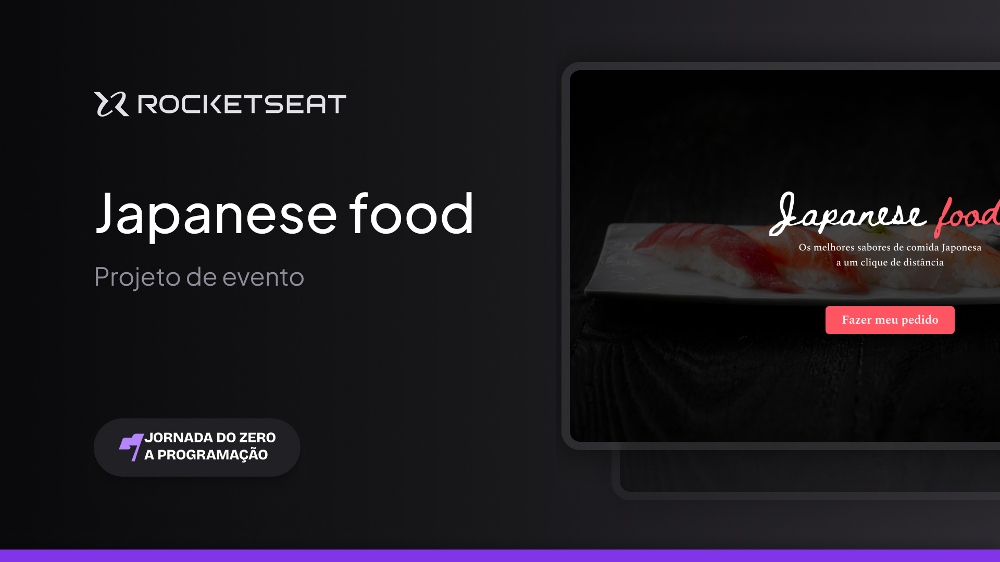

<h1 align="center"> Japanese Food </h1>

Programa exclusivo e gratuito, promovido pela Rocketseat para ensino de tecnologias WEB.  
  Este projeto foi desenvolvido na 11ª Jornada do Zero à Programação - Programa da Rocketseat - entre os dias 13 e 18 de junho de 2024.

  <a href="#-tecnologias">Tecnologias</a>&nbsp;&nbsp;&nbsp;|&nbsp;&nbsp;&nbsp;
  <a href="#-projeto">Projeto</a>&nbsp;&nbsp;&nbsp;|&nbsp;&nbsp;&nbsp;
  <a href="#-layout">Layout</a>&nbsp;&nbsp;&nbsp;|&nbsp;&nbsp;&nbsp;
  <a href="#memo-licença">Licença</a>

  

 

  

## 🚀 Tecnologias

Esse projeto foi desenvolvido com as seguintes tecnologias:

- HTML e CSS
- Git e Github
- Figma

## 💻 Projeto

O projeto é um site desktop de comida japonesa.
Esse é um dos projetos do evento Jornada do Zero à Programação, um dos conteúdos disponíveis para alunos da Rocketseat.

- [Acesse o projeto finalizado, online](https://andreskull2.github.io/roteiro-viagem/)

- [Assistir aulas](https://lp.rocketseat.com.br/devlinks/inscricao?utm_source=github&utm_medium=descricao&utm_campaign=capture-devlinks&utm_term=organic&utm_content=descricao-github-mayk-brito)

## 🔖 Layout

Você pode visualizar o layout do projeto através [DESSE LINK](https://www.figma.com/design/srnQdLHRaRpWNi3W6meeeW/Japanese-food-(Community)?node-id=908-1045&t=0jIo7WqSRdIu97YJ-1). É necessário ter conta no [Figma](https://figma.com) para acessá-lo.

## :memo: Licença

Esse projeto está sob a licença MIT.

---

Feito com ♥ by Rocketseat :wave: [Participe da nossa comunidade!](https://discord.gg/rocketseat)
